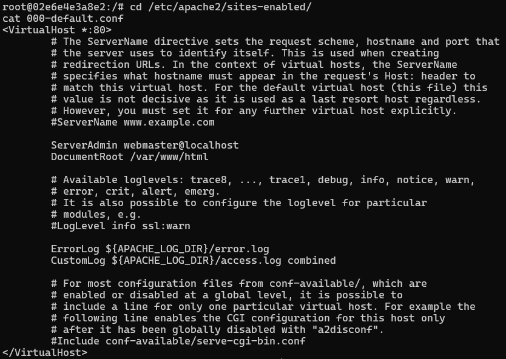

# IWNO4: Использование контейнеров как среды выполнения `Бурцева Дарья, IA2403`

## Цель работы
Данная лабораторная работа призвана повторить основные команды ОС Debian/Ubuntu и познакомиться с Docker и его базовыми командами.

## Задание
Запустить контейнер Ubuntu, установить веб-сервер Apache и вывести в браузере страницу с текстом **"Hello, World!"**.

## Подготовка
Для выполнения работы необходим установленный и запущенный **Docker Desktop**.

---

## Ход выполнения работы

### 1) Создание репозитория
1. Создан репозиторий **containers04** на GitHub.
2. Репозиторий клонирован на компьютер.
3. В папке проекта создан файл **README.md**.

---

## Запуск и тестирование

### 2) Запуск контейнера Ubuntu с пробросом порта
#### Команда:
```
docker run -ti -p 8000:80 --name containers04 ubuntu bash
````
#### Вывод:


#### Назначение:

* `docker run` — создать и запустить контейнер.
* `-t` — выделить псевдо-терминал.
* `-i` — интерактивный режим (чтобы можно было вводить команды).
* `-p 8000:80` — проброс порта: localhost:8000 = 80 в контейнере.
* `--name containers04` — задать имя контейнеру.
* `ubuntu` — образ, на основе которого создаётся контейнер.
* `bash` — команда, которая выполняется внутри контейнера.
---

### 3) Обновление списков пакетов

#### Команда:

```
apt update
```

#### Назначение:

Обновляет списки пакетов из репозиториев (не устанавливает обновления, а проверяет доступные версии.)

#### Вывод:


---

### 4) Установка Apache

#### Команда:

```
apt install apache2 -y
```

#### Назначение:

* Устанавливает веб-сервер Apache2 и зависимости.
* `-y` — автоматически отвечает "yes" на подтверждения установки.

#### Вывод:

```
root@02e6e4e3a8e2:/# apt install apache2 -y
Reading package lists... Done
Building dependency tree... Done
Reading state information... Done
The following additional packages will be installed:
  adduser apache2-bin apache2-data apache2-utils ca-certificates krb5-locales libapr1t64 libaprutil1-dbd-sqlite3
  libaprutil1-ldap libaprutil1t64 libbrotli1 libcurl4t64 libexpat1 libgdbm-compat4t64 libgdbm6t64 libgssapi-krb5-2
  libicu74 libjansson4 libk5crypto3 libkeyutils1 libkrb5-3 libkrb5support0 libldap-common libldap2 liblua5.4-0
  libnghttp2-14 libperl5.38t64 libpsl5t64 librtmp1 libsasl2-2 libsasl2-modules libsasl2-modules-db libsqlite3-0
  libssh-4 libxml2 media-types netbase openssl perl perl-modules-5.38 publicsuffix ssl-cert
Suggested packages:
  liblocale-gettext-perl cron quota ecryptfs-utils apache2-doc apache2-suexec-pristine | apache2-suexec-custom
  www-browser ufw gdbm-l10n krb5-doc krb5-user libsasl2-modules-gssapi-mit | libsasl2-modules-gssapi-heimdal
  libsasl2-modules-ldap libsasl2-modules-otp libsasl2-modules-sql perl-doc libterm-readline-gnu-perl
  | libterm-readline-perl-perl make libtap-harness-archive-perl
The following NEW packages will be installed:
  adduser apache2 apache2-bin apache2-data apache2-utils ca-certificates krb5-locales libapr1t64
  libaprutil1-dbd-sqlite3 libaprutil1-ldap libaprutil1t64 libbrotli1 libcurl4t64 libexpat1 libgdbm-compat4t64
  libgdbm6t64 libgssapi-krb5-2 libicu74 libjansson4 libk5crypto3 libkeyutils1 libkrb5-3 libkrb5support0 libldap-common
  libldap2 liblua5.4-0 libnghttp2-14 libperl5.38t64 libpsl5t64 librtmp1 libsasl2-2 libsasl2-modules
  libsasl2-modules-db libsqlite3-0 libssh-4 libxml2 media-types netbase openssl perl perl-modules-5.38 publicsuffix
  ssl-cert
0 upgraded, 43 newly installed, 0 to remove and 4 not upgraded.
Need to get 26.3 MB of archives.
After this operation, 109 MB of additional disk space will be used.

...

Processing triggers for libc-bin (2.39-0ubuntu8.7) ...
Processing triggers for ca-certificates (20240203) ...
Updating certificates in /etc/ssl/certs...
0 added, 0 removed; done.
Running hooks in /etc/ca-certificates/update.d...
done.
```

---

### 5) Запуск службы Apache

#### Команда:

```
service apache2 start
```

#### Назначение:

Запускает службу Apache внутри контейнера.

#### Вывод:


---

### 6) Проверка в браузере

#### Открываем в браузере:

```
http://localhost:8000
```

#### Что видим:


---

### 7) Просмотр содержимого директории сайта
#### Команда:

```
ls -l /var/www/html/
```

#### Назначение:

Показывает файлы, которые Apache раздаёт как сайт.

#### Вывод:


---

### 8) Замена страницы на "Hello, World!"

#### Команда:

```
echo '<h1>Hello, World!</h1>' > /var/www/html/index.html
```

#### Назначение:

* Записывает HTML-текст в файл `index.html`.
* Символ `>` перезаписывает файл целиком.

#### После обновления страницы в браузере видно:


---

### 9) Просмотр конфигурации виртуального хоста Apache

#### Команды:

```
cd /etc/apache2/sites-enabled/
cat 000-default.conf
```

#### Назначение:

* `cd` — переход в каталог с активными сайтами (виртуальными хостами).
* `cat 000-default.conf` — вывод файла конфигурации “сайта по умолчанию”.

#### Вывод:



#### Что видно на экране:

* Настройки виртуального хоста на порту 80.
* Самое важное поле — `DocumentRoot /var/www/html`, оно показывает папку, откуда Apache раздаёт сайт.

---

### 10) Завершение работы в контейнере

#### Команда:

```
exit
```

#### Назначение:

Выход из `bash` внутри контейнера. Контейнер при этом обычно останавливается, если `bash` был основной командой.

---

### 11) Просмотр списка контейнеров

#### Команда:

```
docker ps -a
```

#### Вывод:


#### Назначение:

Показывает все контейнеры, включая остановленные (`-a`).

---

### 12) Удаление контейнера

#### Команда:

```
docker rm containers04
```

#### Назначение:

Удаляет контейнер по имени.

#### Вывод:


---

## Выводы

В ходе лабораторной работы был запущен контейнер Ubuntu с пробросом порта на локальный компьютер, установлены пакеты Apache2 через `apt`, запущена служба веб-сервера и проверена доступность сайта через браузер по адресу `http://localhost:8000`. Также была изменена стартовая страница сайта путём перезаписи файла `/var/www/html/index.html` на HTML-содержимое “Hello, World!”, после чего результат корректно отобразился в браузере. Дополнительно изучено расположение и содержимое конфигурации сайта по умолчанию `000-default.conf`, где определён `DocumentRoot`.

---

## Библиография

1. Курс Moodle "Контейнеризация и виртуализация"   
   https://elearning.usm.md/course/view.php?id=6806
2. Отличия между командами apt update и apt upgrade   
   https://semenov-sherin.vivaldi.net/itsfoss-apt-update-vs-upgrade/
3. Apache2. Установка и настройка.   
   https://tokmakov.msk.ru/blog/item/774
